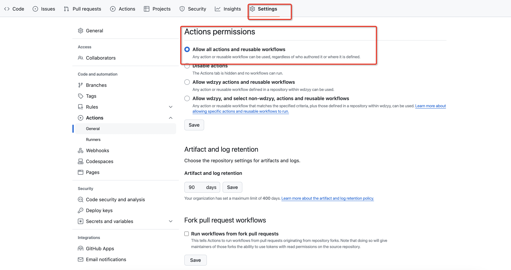
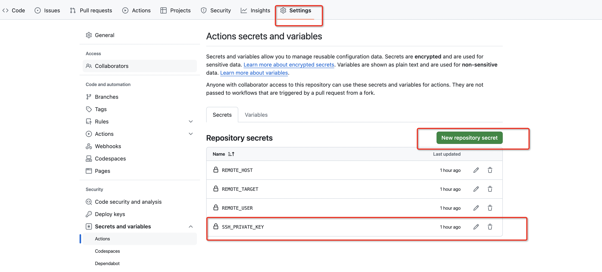
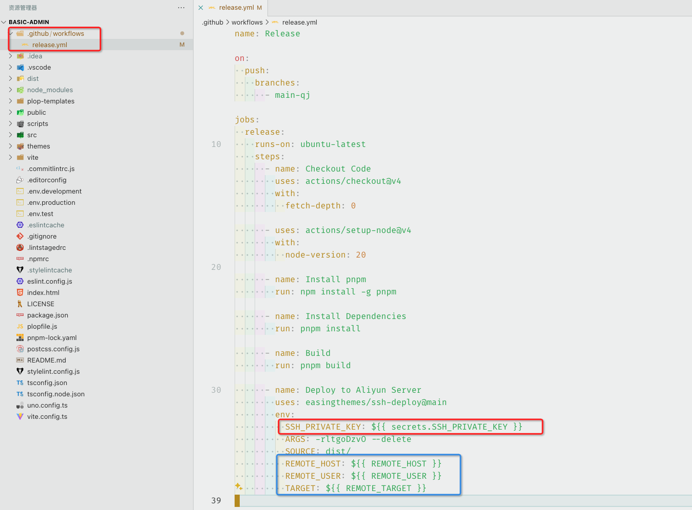
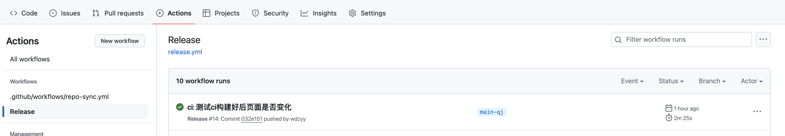
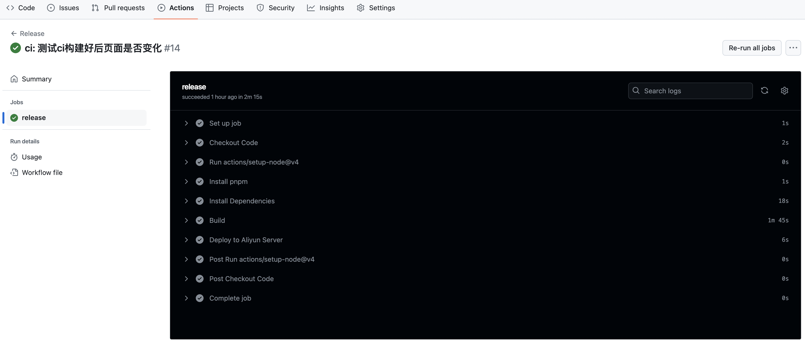

##### 1、先在本地开发的电脑上生成ssh密钥对
  ```
  <!-- xxx@qq.com替换成自己的邮箱 -->
  ssh-keygen -t rsa -C 'xxx@qq.com'
  ```
 
##### 2、通过ssh秘钥登录服务器
```
ssh-copy-id root@120.27.229.201
输入密码后会在服务器的/root/.ssh目录下的authorized_keys写入本地电脑的公钥
```

##### 3、验证是否可以免密登录
```
ssh root@120.27.229.201
如果自动登录服务器则说明成功！
```
##### 4、github Actions配置
  前提：确保服务器装了rsync，我的服务器是Ubuntu系统，安装如下
  ```
  apt-get update && apt-get install rsync
  ```

  1).首先查看是否开启了图中的选项
  
  2).创建ssh私钥，如图，名字SSH_PRIVATE_KEY可以随便写，内容是本地电脑的ssh私钥
  
  3).在本地项目添加.github目录,workflows目录,里面添加对应的yml文件（yml文件自行调整）。图中的SSH_PRIVATE_KEY就是上一步创建的名字，需要相同，其他隐私变量可以同样设置，如下图
  ```
  name: Release

on:
  push:
    branches:
      - main-qj

jobs:
  release:
    runs-on: ubuntu-latest
    steps:
      - name: Checkout Code
        uses: actions/checkout@v4
        with:
          fetch-depth: 0

      - uses: actions/setup-node@v4
        with:
          node-version: 20

      - name: Install pnpm
        run: npm install -g pnpm

      - name: Install Dependencies
        run: pnpm install

      - name: Build
        run: pnpm build

      - name: Deploy to Aliyun Server
        uses: easingthemes/ssh-deploy@main
        env:
          SSH_PRIVATE_KEY: ${{ secrets.SSH_PRIVATE_KEY }}
          ARGS: -rltgoDzvO --delete
          SOURCE: dist/
          REMOTE_HOST: ${{ REMOTE_HOST }}
          REMOTE_USER: ${{ REMOTE_USER }}
          TARGET: ${{ REMOTE_TARGET }}

  ```
  
  4).完成后将代码提交到github仓库，就会触发Action，具体可以在Actions里面查看，如下图
  
  
##### 5、github 自动部署并推送到阿里云服务器就完成啦。各位看官快去配置吧。
