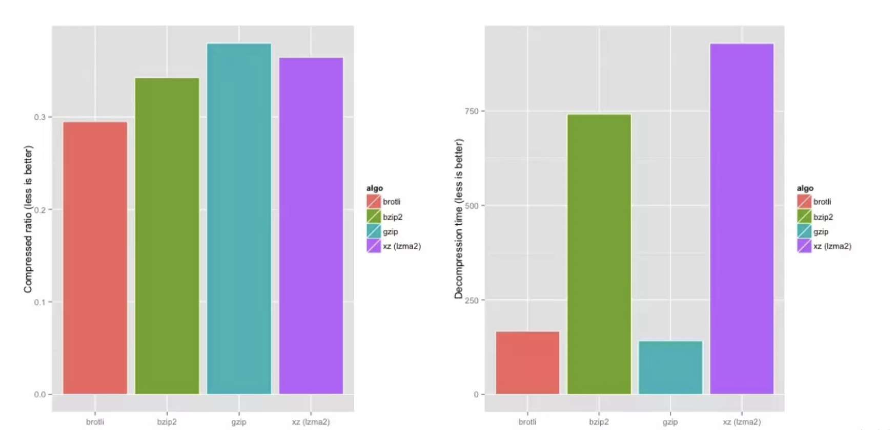

#### 1、什么是Brotli

  Brotli 是谷歌推出的开源压缩算法，比常见的Gzip更高效，它通过变种的 LZ77 算法、Huffman 编码以及二阶文本建模等方式进行数据压缩，帮我们更高效的压缩网页中的各类文件大小，提高加载速度。

  <font color=red>
    Brotli 压缩只在 https 下生效，因为 在 http 请求中 request header 里的 Accept-Encoding是没有 br 的，只有gzip, deflate 。并且 Brotli 和 gzip 是可以并存的，因此无需关闭 gzip，客户端可以根据其能力选择最适合的压缩算法
  </font>

  

  Brotli压缩与其算法压缩对比，从压缩比率和压缩时间来分析brotli、bzip2、gzip、xz这四种压缩算法，brotli两者都位居首位
  

#### 2、如何在项目中使用Brotli(vite5.x)

  1. 安装插件

  ```shell
  pnpm install --save-dev vite-plugin-compression2
  ```

  2. 配置vite.config.ts

  ```javascript
  import { compression } from 'vite-plugin-compression2'
  import type { PluginOption } from 'vite'

  export default async ({ mode, command}) => {
    return defineConfig({
      // ...
      plugins: [
        compression({
          exclude: [/\.(br)$/, /\.(gz)$/],
          algorithm: 'brotliCompress',
        }),
      ]
      // ...
    })
  }
  ```

  尝试一下，打包后会发现dist目录下多了一个br文件
  

  3. 配置nginx.conf

```shell
    #  引入br压缩模块，不引入则无法使用br压缩
    load_module modules/ngx_http_brotli_static_module.so;
    load_module modules/ngx_http_brotli_filter_module.so;

    #  Brotli Settings
    brotli on;
    brotli_static on;
    brotli_comp_level 6;
    brotli_buffers 16 8k;
    brotli_min_length 20;
    brotli_types text/plain text/css application/json application/x-javascript text/xml application/xml application/xml+rss text/javascript application/javascript image/svg+xml image/tiff;
```

  <font color=red>
    注意：由于Brotli压缩只在 https 下生效，因此需要配置https。（可参考下面截图或自行配置）
  </font>

  

  4. Dockerfile配置

  ```shell
    # docker镜像 选择georgjung/nginx-brotli， 省去自己安装brotli的麻烦
    FROM georgjung/nginx-brotli:latest

    COPY nginx.conf /etc/nginx/nginx.conf

    EXPOSE 80

    CMD ["nginx","-g","daemon off;"]
    
  ```

  5. 打包成镜像

  ```shell
    docker build -t brotli .
  ```

  6. docker-compose.yml 配置

  ```shell
    version: '3.1'

    services:
      brotli:
        image: brotli:latest
        container_name: nginxbr
        ports:
          - "80:80"
        volumes:
          - /etc/nginx/nginx.conf:/etc/nginx/nginx.conf
        restart: always
  ```

  7. 启动容器

  ```shell
    docker-compose up -d
  ```
