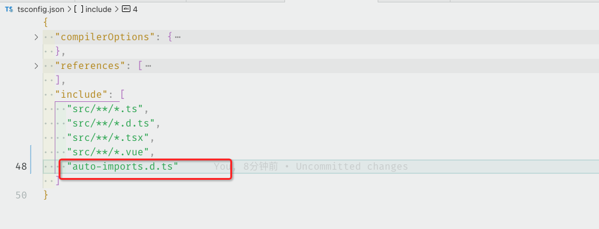
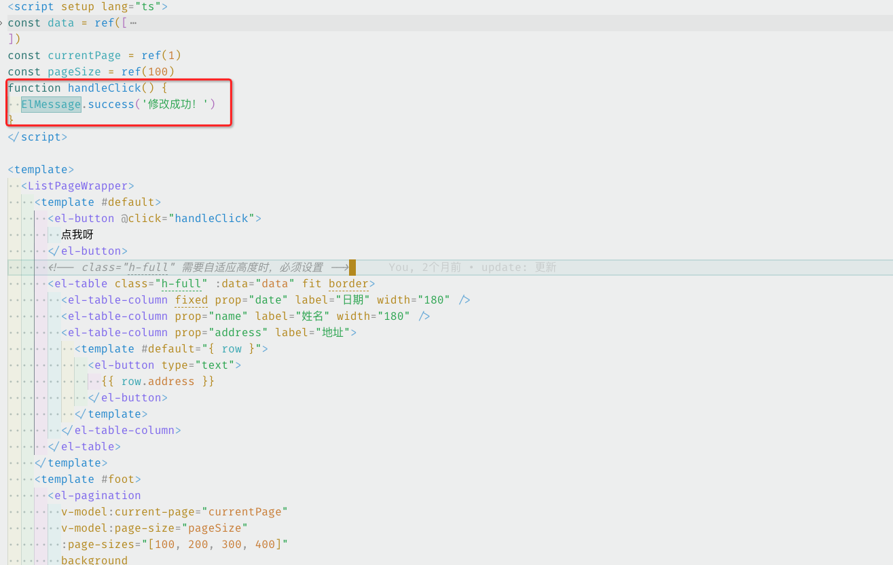

#### 1、安装依赖

```bash
  # 如果有这俩依赖请忽略
  pnpm install sass -D
  pnpm install element-plus
```

tips: 安装element-plus后，无需在main.js中引入element-plus

#### 2、关键步骤开始

    首先安装2个自动导入的依赖

```bash
pnpm install unplugin-vue-components unplugin-auto-import -D
```

#### 3、创建文件夹
  
      在src目录下创建一个theme文件夹，然后在theme文件夹下创建一个index.scss文件
  
```scss
  @forward "element-plus/theme-chalk/src/common/var.scss" with (
  $colors: (
    "primary": (//主题色
      "base": #18A058,
    ),
    "success": (//成功色
      "base": #67C23A,
    ),
    "warning": (//警告色
      "base": #E6A23C,
    ),
    "danger": (//危险色
      "base": #F56C6C,
    ),
    "error": (//错误色
      "base": #F56C6C,
    ),
    "info": (//信息色
      "base": #909399,
    ),
  ),
)
```

#### 4、配置vite.config.js

```js
import AutoImport from 'unplugin-auto-import/vite'
import Components from 'unplugin-vue-components/vite'
import { ElementPlusResolver } from 'unplugin-vue-components/resolvers'
export default defineConfig({
  plugins: [
    AutoImport({
      resolvers: [ElementPlusResolver({
        importStyle: "sass",
      })]
    }),
    Components({
      resolvers: [ElementPlusResolver({
        importStyle: "sass",
      })]
    }),
  ],
  css: {
    preprocessorOptions: {
      scss: {
        // 引入index.scss覆盖文件
        additionalData: `@use "@/theme/index.scss" as *;`,
      }
    }
  }
})
```

tips:
  1、以上代码中的theme/index.scss文件是自己创建的，用于覆盖element-plus的默认样式
  2、additionalData: `@use "@/theme/index.scss" as *;`, 最后面的;不要漏了
  3、vite项目的请忽略第五步

#### 5、配置vue.config.js（与vite配置类似，只是css预处理器不同）

```js
module.exports = {
  css: {
    loaderOptions: {
      scss: {
        additionalData: `@use "@/theme/index.scss" as *;`,
      },
    },
  },
};
```

#### 6、使用Message等组件时，没有样式时，如下处理



```bash
  # tsconfig.json
  "include": [
    "auto-imports.d.ts"
  ]
```

###### 组件中使用时



```bash
 # 无需引入 import { ElMessage, ElMessageBox } from 'element-plus'
 # 直接使用即可
  ElMessage.success('修改成功！')
```
